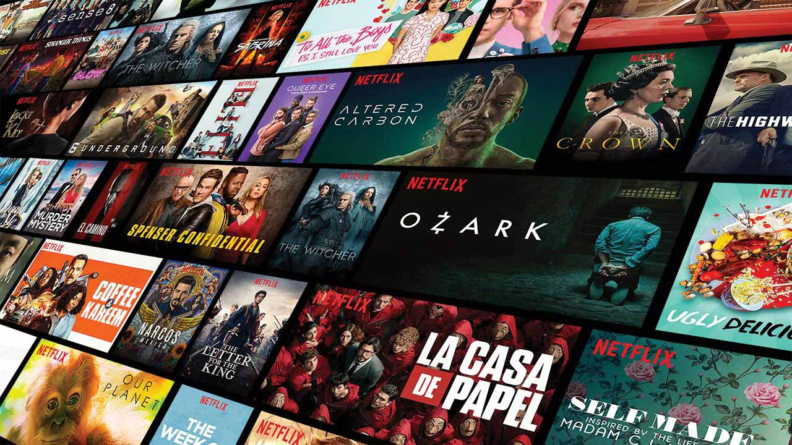
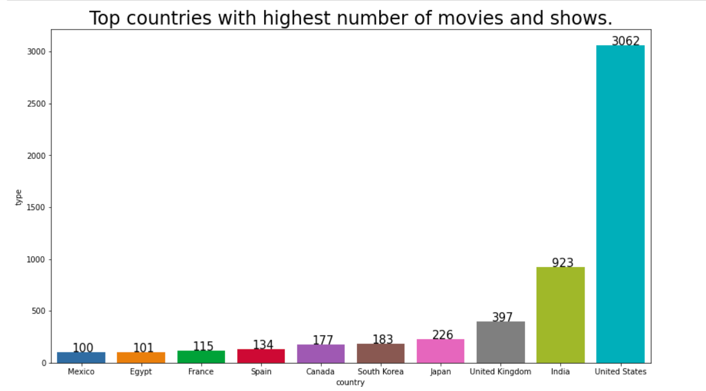

# Abdelrhman Wahdan
*Hi, I'm a Data scientist with 3+ years of experience using predictive modeling, data processing, and data mining algorithms
to solve challenging business problems who loves to share his knowledge with others and teaching them. 
I'd love to combine my passion for learning and teaching with my machine learning and natural language processing skills
to start building personalized learning products for people.*

# Education
* Bachelor's Degree Faculty of computer and artificial intelligence , *Helwan university* 04/2017 - 06/2021.

# [Project 1: Mobile price prediction](https://github.com/abdelrhmanwahdan/mobile-price-classification)

# AIM
In this Project,We're going to predict the price range of each mobile in the dataser based on the mobile specifications as : Battery power, 3G enabled , wifi ,Bluetooth, Ram etc .

# Usage
- This kind of prediction will help companies to  estimate the price of mobiles of an mobile phone based on its specifications.
- Beside that it will help Consumers to verify that they are paying best price according to the specs of the mobile.

# Contents
1. **About the data.**

2. **Importing the libraries and the data.**

3. **Understanding the data.**

4. **Data analysis and visualization.**

    

    ### How does ram is affected by price ?

    

    ### What is the relation between Internal Memory and Price Range ?

    

    ### What is the percentage of Phones which support 3G ?

    

    ### What is the percentage of Phones which support 4G ?

    

    ### What is the relation between Battery power and Price Range ?

    

    ### Visualizing No of Phones vs Camera megapixels of front and primary camera.
    

    

    ### What is the relation between Mobile Weight and Price Range ?

        

    ### What is the relation between Talk time and Price Range ?

    
    
    

5. **Preprocessing the data.**

    1. Normalizing the continuous columns.

    2. Splitting the data.

6. **developing the machine learning models.**

    1. Linear regression.
    
    2. Logistic regression.

    3. Decision tree.

    4. SVM.

    5. K-Nearest neighbors.

    6. Random forest.

7. **Conclusion.**

8. **Prediction on the test set.**

# Conclusion

logistic regression model outperforms other models in the mobile price calssification problem with accuracy 94% .

# [Project 2: Students performance in exams](https://github.com/abdelrhmanwahdan/Students-performance-in-exams)

# Aim
The aim of this project is to understand the various facts like economic, personal and social on the students performance.

# Inferences would be :
1. How to imporve the students performance in each test ?
2. What are the major factors influencing the test scores ?
3. Effectiveness of test preparation course?

# Contents
0. **Importing the libraries and the data.**

1. **Understanding the data.**

2. **Data analysis and visualization.**

    ### How many students passed in Math exam ?
    

    
    

    ### How many studends passed in reading ?

    
    

    ### How many students passed writing ?

    
    
    

    ### How many students passed in all the subjects ?

    
    
    
    
    ### What are the grades of the students ?

    
    
    

3. **Preprocessing the data.**

    1. Removing unnecessary columns.

    2. Transform target categories into numbers.

    3. One hot encoding for categorical columns.

    4. Normalizing the continuous columns.

    5. Splitting the data.

4. **developing the machine learning models**

    1. Logistic regression.

    2. Decision tree.

    3. SVM.

    4. K-Nearest neighbors.

    5. Random forest.

5. **Evaluating the model**

# Conclusion

the random forest model outperforms the other models in the prediction of the students grades with accuracy 91.5% .

# [Project 3: EDA on Netflix Movies and TV Shows dataset](https://github.com/abdelrhmanwahdan/EDA-on-Netflix-Movies-and-TV-Shows-data-set)

Who doesn’t like Netflix? This dataset on Kaggle has TV shows and movies available on Netflix. One can create a good quality Exploratory Data Analysis project using this dataset. Using this dataset, one can find out: what type of content is produced in which country, identify similar content from the description, and much more interesting tasks.
So in this project I am doing exploratory data analysis (data cleaning , data processing , data visualizations) on this dataset.

### Contents
0. **ABOUT THE DATA**

1. **IMPORTING LIBRARIES**

2. **DATA DESCRIPTION AND DATA CLEANING**

    1. Import data

    2. Data types

    3. Missing values  

    
    

    
3. **DATA ANALYSIS AND CONCLUSIONS**

    ### How content is distributed ?

    

    ### WHAT ARE THE COUNTRIES WITH HIGHEST NUMBER OF MOVIES & TV-SHOWS ?

    

    ### what is the content added in each year ?

    

    ### what are the ratio of the genres ?

    

4. **RECOMMENDATION SYSTEM**

### About the data

#### FEATURES:

1. SHOW-ID - Unique id of each show (not much of a use for us in this project)
2. TYPE - The category of a show, can be either a Movie or a TV Show
3. TITLE - Name of the show
4. DIRECTOR - Name of the director(s) of the show
5. CAST - Name of the show
6. COUNTRY - Name of countries the show is available to watch on Netflix
7. DATE ADDED - Date when the show was added on Netflix
8. RATING - Show rating on netflix
9. RELEASE YEAR - Release year of the show
10. DURATION - Time duration of the show
11. LISTED IN - Genre of the show

# [Project 4: DNN speech recognizer](https://github.com/abdelrhmanwahdan/DNN-Speech-Recognizer)

Photo by <a href="https://unsplash.com/@omidarmin?utm_source=unsplash&utm_medium=referral&utm_content=creditCopyText">Omid Armin</a> on <a href="https://unsplash.com/s/photos/siri?utm_source=unsplash&utm_medium=referral&utm_content=creditCopyText">Unsplash</a>
  
In this project, I will build a deep neural network that functions as part of an end-to-end automatic speech recognition (ASR) pipeline!
I begin by investigating the LibriSpeech dataset that will be used to train and evaluate my models. my algorithm will first convert any raw audio to feature representations that are commonly used for ASR. I will then move on to building different architectures of  neural network models that can map these audio features to transcribed text.

#### **Setup:**
This project requires GPU acceleration to run efficiently.

#### **contents:**
1. **Data wrangling (Data gathering , Data assessing , Data cleaning).**
2. **Exploratory Data Analysis.**
3. **Making some conclusions about the data.**
4. **developing the models which are :**
    1. Model 0: RNN
    2. Model 1: RNN + TimeDistributed Dense
    3. Model 2: CNN + RNN + TimeDistributed Dense
    4. Model 3: Deeper RNN + TimeDistributed Dense
    5. Model 4: Bidirectional RNN + TimeDistributed Dense
    6. Model 5: Custom**
    7. model 6: final model
5. **visualizing and evaluating the models.**

# [Project 5: Breast cancer detection](https://github.com/radwaahmed548/BCD)

Photo by <a href="https://unsplash.com/@nci?utm_source=unsplash&utm_medium=referral&utm_content=creditCopyText">National Cancer Institute</a> on <a href="https://unsplash.com/s/photos/breasr-cancer-detection?utm_source=unsplash&utm_medium=referral&utm_content=creditCopyText">Unsplash</a>
  

This application is about offering women a way to remind them to self-examine
each month and for cancer patients to detect the type of cancer and help them to
plan their new journey against this disease. As an application, it requires
registration from users. Users can either choose to see a video of the self-
examination or go to the prediction tab and enter their test results to determine
the type of tumor. Also, users can provide their feedback or ask any questions.
Also, they can share stories and see other people’s stories.

#### **Abstract:**
Now days, breast cancer is the most frequently diagnosed life-threatening
cancer in women and the leading cause of cancer death among women. In 2020,
there were 2.3 million women diagnosed with breast cancer and 685 000 deaths
globally. Unfortunately, it’s very common so our project aims to help women
by either reminding them to their monthly self-examination for early detection
or helping women who already has suspicions about having cancer by detecting
the result of their test and making their journey with treatments and dealing with
cancer a little bit easier .

#### **Overview:**
- This application reminds the user to her self-examination every month.
- It can predict whether the tumor is benign or malignant based on blood
test results.
- It can help the user to set-up a calendar to remind her with her doctor
appointments, chemotherapy sessions and her medications.
- It offers community support where other users can share their stories
about their journey and how.

#### **documentation:**
- The main target of this Document is to describe our solution in dealing with
breast cancer that we will develop. The documentation gives a detailed
description of the both functional and non-functional requirements in details and
describes the hardware and software interface requirements.

#### **Objectives:**
- Save time: by entering your test results the application can
predict if your tumor is benign or malignant.
- Raise Awareness: Most women forget to do their monthly
check-ups even though they can be lifesaving as detecting if
there is a tumor early can help with treatment and increase
chances of healing.
- Support Patients: Having cancer have its own mental effects as
well as physical, knowing that someone is going through the
same thing as you can help patients and reading other people’s
survival stories can inspire them and give them hope.

#### **What materials and equipment does the project need?**
- Hardware: A high functioning smartphone with Wi-Fi is all that is needed.
- Software:
    - Operating system: Android or IOS.
    - Programming language: Dart.
    - Database: Firebase.
    - Python.

# [Project 6: Machine translation](https://github.com/abdelrhmanwahdan/machine-translation)

Photo by <a href="https://unsplash.com/@rvignes?utm_source=unsplash&utm_medium=referral&utm_content=creditCopyText">Romain Vignes</a> on <a href="https://unsplash.com/s/photos/language-translation?utm_source=unsplash&utm_medium=referral&utm_content=creditCopyText">Unsplash</a>
  
In this project, I build a machine translation model Using CNNS, GRUS, transformers that functions as part of an end-to-end machine translation pipeline. My completed pipeline will accept English text as input and return the French translation.

#### **Setup:**
This project requires GPU acceleration to run efficiently.

#### **contents:**
1. **Data wrangling (Data gathering , Data assessing , Data cleaning).**
2. **Exploratory Data Analysis.**
3. **Making some conclusions about the data.**
4. **developing the models which are :**
    1. Model 1: RNN
    2. Model 2: Embedding
    3. Model 3: Bidirectional RNNs
    4. Model 4: Encoder-Decoder**
    5. Model 5: Custom
5. **visualizing and evaluating the models.**

# [Project 7: IMDb movie data project](https://github.com/abdelrhmanwahdan/IMDb-movie-data-project)

Photo by <a href="https://unsplash.com/@firmbee?utm_source=unsplash&utm_medium=referral&utm_content=creditCopyText">Firmbee.com</a> on <a href="https://unsplash.com/s/photos/data-visualiztion?utm_source=unsplash&utm_medium=referral&utm_content=creditCopyText">Unsplash</a>
  
  
in this project I investigate ,analyze ,clean and visualize The IMDb movie data.

#### **contents:**
1. **Data wrangling (Data gathering, Data assessing, Data cleaning).**
2. **Exploratory Data Analysis.**
3. **getting answers on some questions about the correlations between the features of the dataset and if there any relation between them.**

